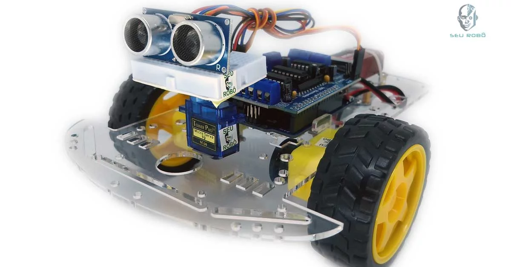
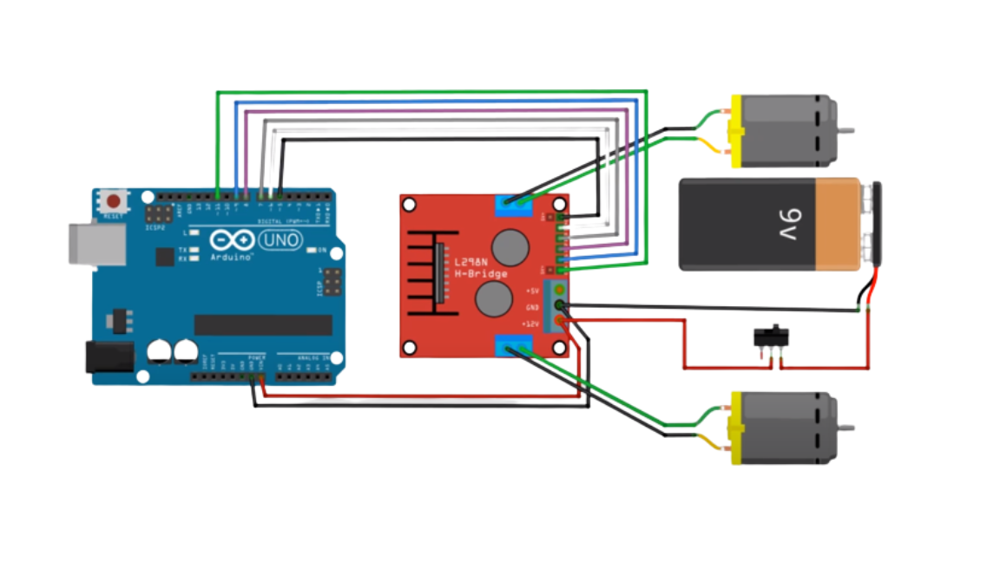

# Projeto de Sistemas Microprocessados - Universidade Federal da Bahia 📚

# Instrumentação de um Robô Diferencial 🤖

> ## Descrição 📚
O desenvolvimento do robô diferencial envolveu a programação direta dos registradores do microcontrolador ATmega328P, utilizando a linguagem C/C++ na IDE MPLAB X. O robô foi equipado com um sensor ultrassônico HC-SR04 para detecção de obstáculos à frente e uma ponte H L298N para controlar a direção de rotação dos motores DC.

### Configuração do Hardware:

1. **Microcontrolador ATmega328P:**
   - Configuração dos pinos de I/O para controle dos motores e leitura do sensor ultrassônico.
   - Definição das interrupções necessárias para o tratamento de eventos.

2. **Sensor Ultrassônico HC-SR04:**
   - Configuração dos pinos de trigger e echo para comunicação com o microcontrolador.
   - Implementação do algoritmo de medição de distância com base no tempo de retorno do pulso ultrassônico.

3. **Ponte H L298N:**
   - Configuração dos pinos de controle da ponte H para acionamento dos motores.
   - Implementação de funções para controle de rotação dos motores em diferentes direções.

### Algoritmo do Robô Diferencial:

1. **Inicialização:**
   - Configuração dos registradores e periféricos do microcontrolador.
   - Calibração do sensor ultrassônico, se necessário.

2. **Loop Principal:**
   - Leitura da distância medida pelo sensor ultrassônico.
   - Tomada de decisão com base na distância lida:
      - Se a distância for suficientemente grande, o robô segue em frente.
      - Se a distância for pequena, o robô realiza uma manobra para evitar o obstáculo.

3. **Controle dos Motores:**
   - Utilização da ponte H para controlar a rotação dos motores.
   - Implementação de lógica para movimentação diferencial, permitindo o giro e a locomoção do robô.

4. **Interrupções:**
   - Tratamento de interrupções, como aquelas geradas pelo sensor ultrassônico.
   - Atualização contínua do estado do robô com base nas leituras dos sensores.

### Desenvolvimento na IDE MPLAB X:

1. **Configuração do Projeto:**
   - Seleção do dispositivo ATmega328P.
   - Inclusão de bibliotecas necessárias para o desenvolvimento.

2. **Programação Direta dos Registradores:**
   - Utilização de registradores para manipular diretamente os pinos, timers e outros periféricos.
   - Implementação de funções específicas para configuração e controle.

3. **Depuração e Testes:**
   - Utilização de ferramentas de depuração da IDE para verificar o fluxo do programa.

O código C/C++ desenvolvido na IDE MPLAB X integra a lógica de controle do robô, interação com o sensor ultrassônico e o acionamento dos motores através da ponte H L298N. Esse projeto possibilita a criação de um robô diferencial capaz de se locomover e evitar obstáculos de forma autônoma.

 
 

> ## Tecnologias 👨🏾‍💻
Foram utilizadas as seguintes tecnologias neste projeto:
+ Linguagem:
  - C
  - C++
+ IDE:
  - MPLAB X IDE
  - Microchip Studio

 
 

> ## Printscreen do Projeto 📸
## Esquema exemplo do Circuito

## Esquema exemplo do Circuito

Variando a distância detectada pelo sensor ultrassônico por meio de uma tensão aplicada nele, vemos que o sentido da rotação e velocidade dos motores DC são alterados, possibilitando que ele realize a manobra com intuito de desviar de um possível obstáculo à sua frente.

 
 

> ## Autores 📝
+ [Ruan Cardoso](https://www.linkedin.com/in/ruancardosolinkdin/)
+ [Mikelly Correia](https://www.linkedin.com/in/mikelly-correia-75b85a203/)
+ [Edilton Damasceno](https://www.linkedin.com/in/edilton-damasceno-1958b01a0/)
+ [Kelmer Passos](https://www.linkedin.com/in/kelmer-passos-988983144/)

OBS: Os arquivos .sim1 são para o simulador Simulide
